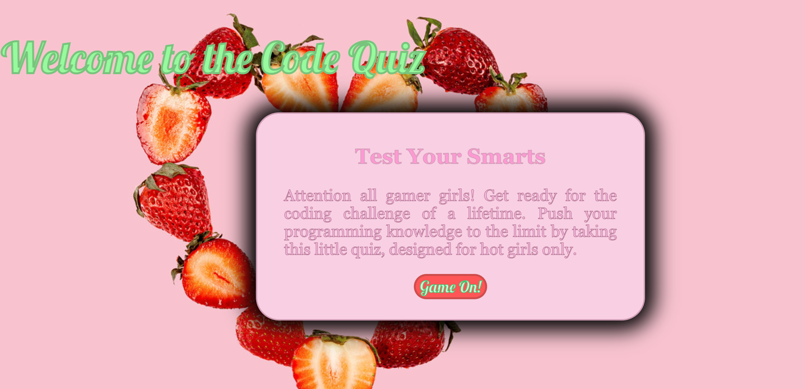
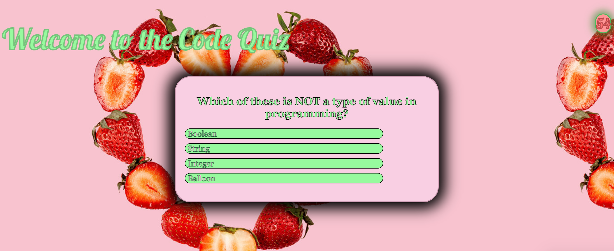
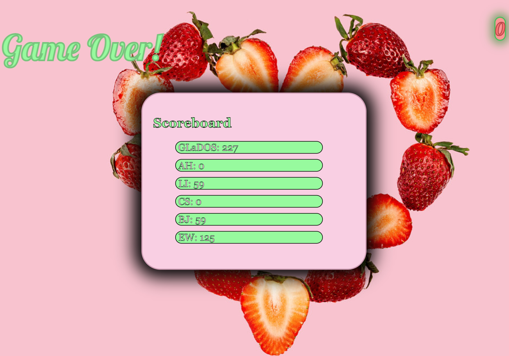

# 🌸 welcome to my coding quiz! 🌸 

here's a quiz all about coding that i developed for the UC Berkeley full stack development course.   

in this assignment, i was tasked with:
  

🍓 creating a dynamic and interactive quiz with a countdown timer  
🍓 storing all user scores and the current high score to local storage  
🍓 retrieving these scores from local storage to then dynamically add them to the webpage   
🍓 designing the webpage to be responsive   

here are some screenshots of my work: 
  

 

you can view the deployed application here: <a href=“https://descardi-b.github.io/code-quiz/“>https://descardi-b.github.io/code-quiz/</a>
